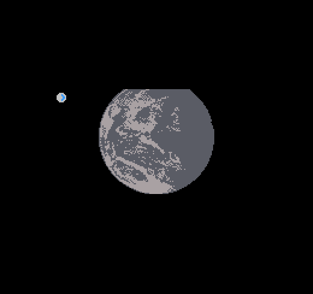

# Orbit Throbbing Star

Author: Hao Chen

Design: Try to orbit around the star with your limited engine. Do not crash!

Screen Shot:

How Your Asset Pipeline Works:

1. Draw assets with pad/ process image to usable assets
2. Export assets to project manually in a portable format
3. Use preprocessor to convert assets to runtime usable binary bytes leveraging png libraries provided  
  ** You need to run it manually! It will be built under dist folder **
4. In runtime, load bytes into memory directly

How To Play:

- Use your arrow keys to accelerate your spaceship orbiting the star to explore it.
- The star's gravity field is changing.
- Your engine has limited power. Be careful.

Sources: 
- The planet assets are created based on the picture from NASA Earth Observatory [Twin Blue Marbles](https://earthobservatory.nasa.gov/images/8108/twin-blue-marbles) in public domain

This game was built with [NEST](NEST.md).

